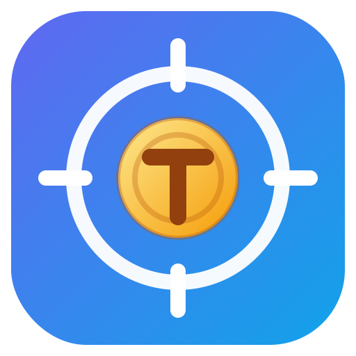

<p align="center">
  
</p>

# TokenScope


**See where your Claude Code and Codex tokens actually went.**

TokenScope is a native macOS menu bar app that reads your local Claude Code and
Codex CLI logs and shows where your AI coding tokens and costs went — per
provider, per model, per project, per session. Zero config: it detects the logs
automatically. Everything stays on your Mac.

## Features

- **Automatic detection** of Claude Code (`~/.claude`) and Codex CLI (`~/.codex`) logs
- **Cost & token breakdown** — estimated spend by provider, model, and project/repo
- **Session timeline** with per-session insights
- **Token phase analysis** — where tokens go within a session (input, output, cache)
- **Waste signals** — repeated file reads, broad searches, repeated directory listings, repeated failed commands
- **Time ranges** — Total, Today, 7 days
- **Incremental refresh** with content-hash dedup, backed by SQLite
- **100% local** — no login, no API keys, no cloud, no telemetry

## Install

### Build from source

Requires macOS 13+ and Xcode command line tools (Swift 5.9+).

```sh
git clone https://github.com/w05191998/TokenScope.git
cd TokenScope
swift build -c release
.build/release/TokenScope
```

### Package a DMG

```sh
scripts/package_unsigned_dmg.sh
```

Artifacts are written to `dist/TokenScope-*`. Builds are currently **unsigned** —
macOS Gatekeeper will warn on first open (right-click → Open to bypass).

### Run tests

```sh
swift test
```

## Privacy

All data stays on your Mac.

- No telemetry
- No cloud
- No login
- No external network calls — the codebase contains zero networking code; it
  only reads local log files via `FileManager`

## How it works

```
~/.claude, ~/.codex logs
        │
        ▼
  Scanner ──▶ Provider parsers ──▶ Normalizer ──▶ SQLite storage
                                                       │
                                                       ▼
                                        Menu bar summary + popover analytics
```

Key docs:

- [`docs/ARCHITECTURE.md`](docs/ARCHITECTURE.md) — module layout and data flow
- [`docs/DATA_MODEL.md`](docs/DATA_MODEL.md) — normalized usage model
- [`docs/SUPPORTED_FORMATS.md`](docs/SUPPORTED_FORMATS.md) — Claude/Codex log formats
- [`docs/PRICING_CATALOG.md`](docs/PRICING_CATALOG.md) — how cost estimates are derived
- [`docs/CONTRIBUTING.md`](docs/CONTRIBUTING.md) — contribution guidelines

Cost figures are **estimates** from a manually maintained pricing catalog, not
billing-grade reconciliation.

## Roadmap (not in MVP)

Cloud sync, team dashboards, Windows/Linux support, PR analytics, cost per
commit, and automatic online pricing updates are explicitly out of scope for
the MVP. See [`docs/ROADMAP.md`](docs/ROADMAP.md).

## Development process

This project was built with an orchestrator-agent AI workflow: a strongest-model
orchestrator acting as tech lead, delegating milestones to focused
implementation agents. The full process is documented in the repo —
[`ORCHESTRATOR.md`](ORCHESTRATOR.md), [`AI.md`](AI.md), [`prompts/`](prompts/),
and [`docs/MILESTONES.md`](docs/MILESTONES.md) — as a working example of
AI-driven development with human review at every milestone.

## License

[MIT](LICENSE)
